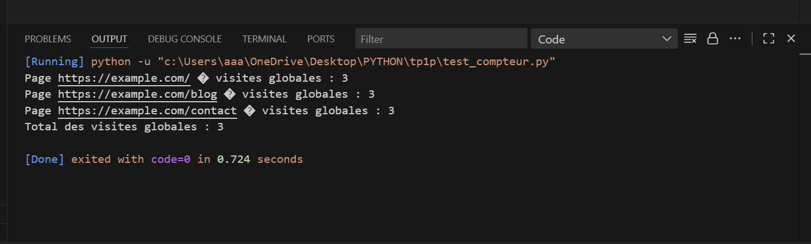
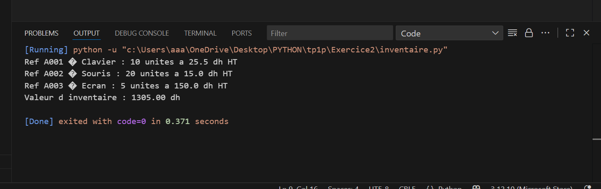
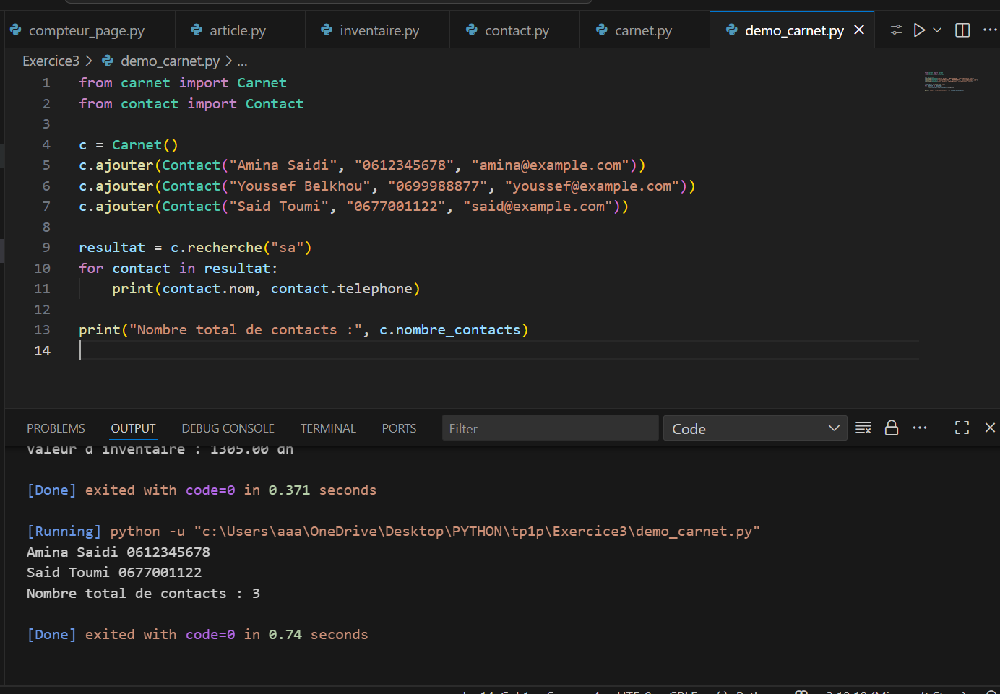
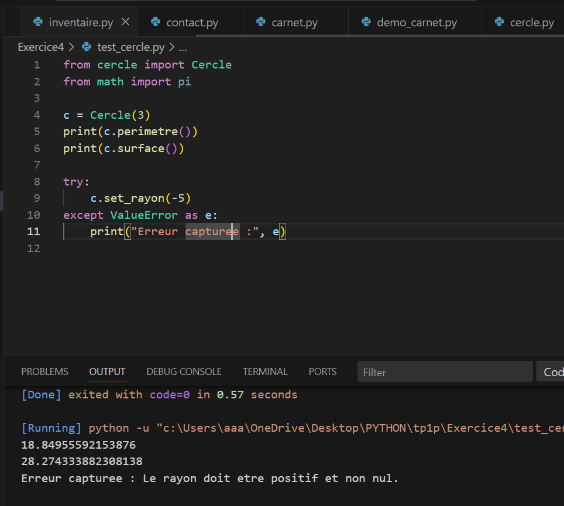
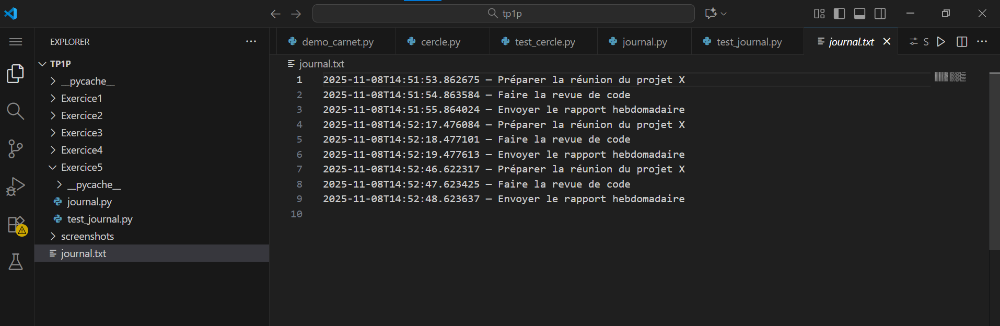

"# TP1_python" 
# 🧠 TP1 - Programmation PYTHON

Ce projet contient les exercices du TP1 en Python.

## 📸 Captures d’écran

Voici les résultats d’exécution :








---

## ⚙️ Compilation
```bash
g++ main.cpp -o main
./main
